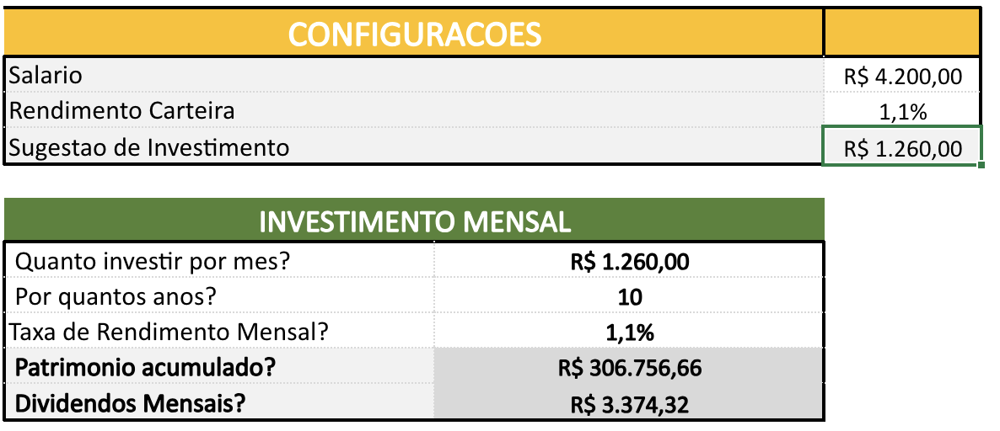
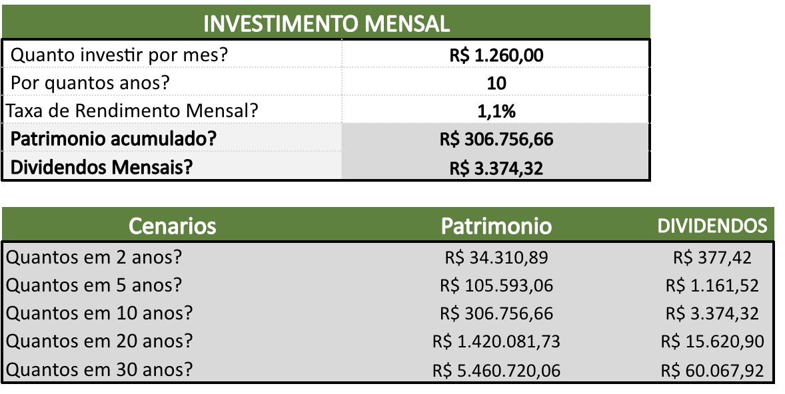
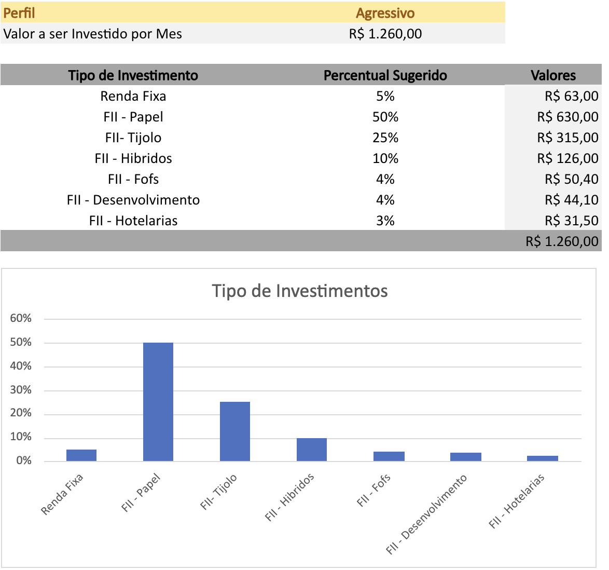

# 📊 Simulador de Investimentos em Excel

## 📌 Sobre o projeto

Este projeto consiste no desenvolvimento de uma ferramenta de **simulação de investimentos em Excel**, criada para auxiliar na análise da evolução patrimonial a partir de aportes mensais, diferentes períodos de investimento e taxas de rendimento.

A ferramenta permite simular cenários de longo prazo, estimar o patrimônio acumulado e calcular uma projeção de dividendos mensais, além de apresentar uma sugestão de distribuição da carteira de acordo com diferentes perfis de investimento.

---
## 🖥️ Demonstração

### ⚙️ Configuração da simulação



 A ferramenta permite definir os principais parâmetros utilizados na simulação, como salário, percentual de investimento, aporte mensal,
período e taxa de rendimento.

### 📈 Simulação de cenários



A ferramenta permite analisar diferentes horizontes de investimento, projetando o patrimônio acumulado e os dividendos mensais estimados
para períodos de 2, 5, 10, 20 e 30 anos.

### 💰 Distribuição da carteira



A partir do perfil selecionado, a ferramenta utiliza uma tabela de referência para calcular automaticamente o percentual sugerido e o
valor destinado a cada categoria de investimento.

---

## 🎯 Objetivos

* Criar ferramentas de simulação de investimentos em Excel;
* Aplicar cálculos financeiros como rendimento mensal e cálculo de dividendos;
* Simular a evolução do patrimônio considerando diferentes períodos;
* Criar uma lógica de distribuição de investimentos por perfil;
* Automatizar cálculos utilizando fórmulas do Excel;
* Documentar processos técnicos de forma clara e estruturada;
* Transformar cálculos financeiros em uma ferramenta de apoio à tomada de decisão.

---

## ⚙️ Funcionalidades

A planilha possui uma área de configuração que permite definir os principais parâmetros da simulação:

* Salário mensal;
* Percentual destinado aos investimentos;
* Valor do aporte mensal;
* Taxa de rendimento mensal;
* Período de investimento;
* Rendimento estimado da carteira;
* Perfil de investimento.

A partir desses parâmetros, os resultados são calculados automaticamente.

---

## 🧮 Fórmulas e funções utilizadas

Um dos principais objetivos do projeto foi aplicar **fórmulas do Excel para automatizar os cálculos financeiros** e reduzir a necessidade de cálculos manuais.

### `FV` — Valor futuro

A função `FV` foi utilizada para calcular o patrimônio futuro considerando:

* Taxa de rendimento mensal;
* Quantidade de períodos;
* Aporte mensal.

Exemplo utilizado na planilha:

```excel
=FV(taxa_mensal;qtd_anos*12;aporte*-1)
```

A função também foi utilizada para calcular diferentes cenários de investimento:

```excel
=FV($C$23;$A33*12;$C$21*-1)
```

Dessa forma, é possível projetar o crescimento do patrimônio em diferentes horizontes de tempo.

---

### Cálculo de dividendos

Após o cálculo do patrimônio projetado, a planilha estima os dividendos utilizando o rendimento definido para a carteira.

Fórmula utilizada:

```excel
=patrimonio*rendimento_carteira
```

A mesma lógica é aplicada aos diferentes cenários:

```excel
=C28*rendimento_carteira
```

```excel
=C29*rendimento_carteira
```

Esse cálculo permite estimar o potencial de geração de renda mensal a partir do patrimônio acumulado.

---

### `PROCV` — Busca de informações

A função `PROCV` foi utilizada para automatizar a busca dos percentuais de alocação de acordo com o **perfil de investimento** e a **categoria do ativo**.

Exemplo utilizado:

```excel
=Procv($C$36&"-"&B40;Planilha2!$A:$D;4;FALSE)
```

A fórmula combina o perfil selecionado com a categoria do investimento e realiza uma busca na tabela de referência localizada na segunda planilha.

Isso permite que a distribuição da carteira seja atualizada automaticamente de acordo com o perfil selecionado.

---

### Operações matemáticas

Também foram utilizadas operações matemáticas para calcular os valores destinados a cada categoria da carteira.

Exemplo:

```excel
=C40*$C$37
```

Nesse caso, o percentual de alocação é multiplicado pelo valor disponível para investimento.

---

### `SUM` — Total da carteira

A função `SUM` foi utilizada para consolidar os valores calculados para as diferentes categorias de investimento.

Exemplo:

```excel
=SUM(D40:D46)
```

Essa fórmula permite obter o total resultante da distribuição calculada.

---

### Concatenação de dados

Na tabela auxiliar da planilha, foi utilizada a concatenação de informações para criar uma chave de busca:

```excel
=C2&"-"&B2
```

Essa estrutura permite combinar o perfil de investimento e a categoria do ativo em uma única referência utilizada posteriormente pelas funções `VLOOKUP`.

---

## 📈 Simulação de cenários

A ferramenta permite comparar diferentes períodos de investimento:

| Período | Análises realizadas                         |
| ------- | ------------------------------------------- |
| 2 anos  | Patrimônio acumulado e dividendos estimados |
| 5 anos  | Patrimônio acumulado e dividendos estimados |
| 10 anos | Patrimônio acumulado e dividendos estimados |
| 20 anos | Patrimônio acumulado e dividendos estimados |
| 30 anos | Patrimônio acumulado e dividendos estimados |

Essa estrutura permite observar o impacto do **tempo, dos aportes recorrentes e da rentabilidade** na formação do patrimônio.

---

## 💰 Distribuição da carteira

A planilha possui uma estrutura de sugestão de alocação baseada em diferentes perfis:

* **Conservador**
* **Moderado**
* **Agressivo**

As categorias consideradas incluem:

* Renda Fixa;
* FII - Papel;
* FII - Tijolo;
* FII - Híbridos;
* FII - FOFs;
* FII - Desenvolvimento;
* FII - Hotelarias.

A combinação de `PROCV`, concatenação e operações matemáticas permite automatizar a distribuição do valor disponível entre as diferentes categorias.

---

## 🛠️ Ferramentas e recursos utilizados

* **Microsoft Excel**
* Fórmula `FV`
* Função `PROCV`
* Função `SUM`
* Operações matemáticas
* Concatenação de dados
* Tabelas de referência
* Simulação de cenários
* Modelagem de cálculos financeiros
* Automatização de cálculos

---

## 🧠 Competências demonstradas

Este projeto demonstra conhecimentos em:

* Criação de ferramentas de análise em Excel;
* Aplicação de cálculos financeiros;
* Utilização de juros compostos;
* Simulação de cenários;
* Automatização de processos;
* Estruturação de regras de negócio;
* Utilização de funções de busca;
* Organização e tratamento de dados;
* Construção de tabelas auxiliares;
* Documentação técnica;
* Desenvolvimento de ferramentas para apoio à tomada de decisão.

---

## 🚀 Como utilizar

1. Abra o arquivo `Simulacao_de_investimento.xlsx`;
2. Acesse a área de configurações;
3. Informe os parâmetros desejados;
4. Defina o valor do aporte mensal;
5. Informe a taxa de rendimento;
6. Selecione o período de investimento;
7. Analise o patrimônio acumulado;
8. Consulte a projeção de dividendos;
9. Selecione o perfil de investimento;
10. Analise a distribuição sugerida da carteira.

---

## 📁 Estrutura do projeto

```text
simulador-investimentos/
│
├── Simulacao_de_investimento.xlsx
└── README.md
```

---

## ⚠️ Observação

Os valores apresentados pela ferramenta são **simulações baseadas nos parâmetros informados pelo usuário** e não representam garantia de rentabilidade ou recomendação de investimento.

---

## 👤 Autor

**Felipe Feliciano**

Projeto desenvolvido como parte do portfólio de desenvolvimento de habilidades em **Excel, análise de dados e Business Intelligence**.
